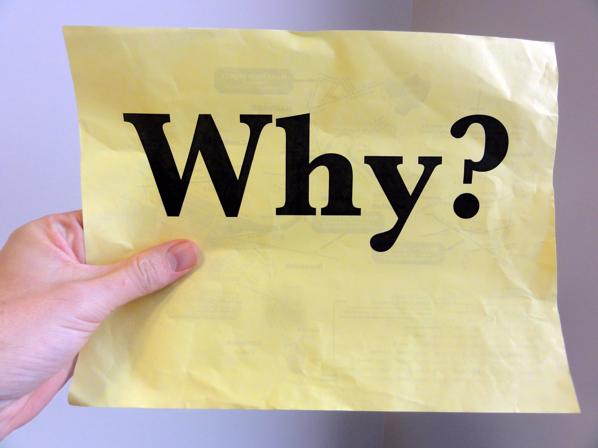
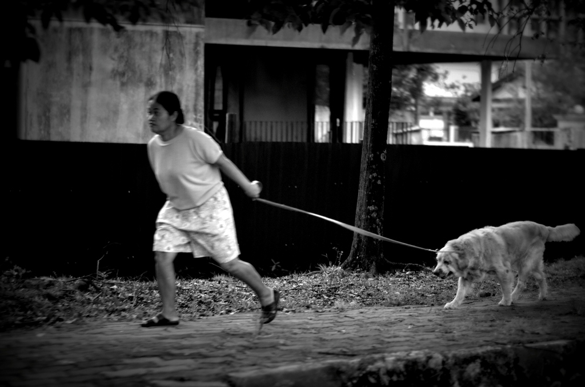
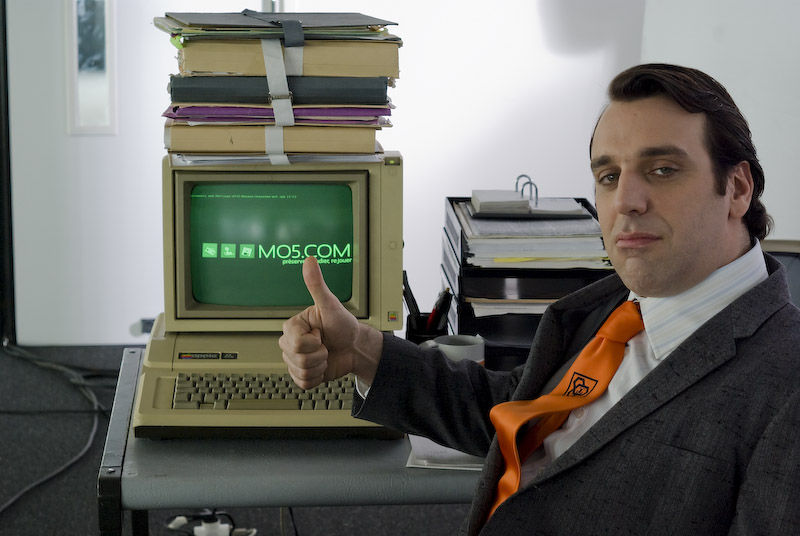
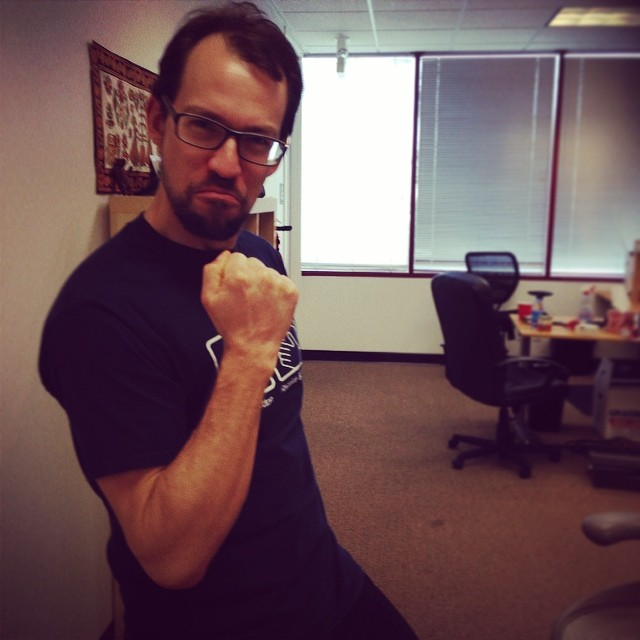
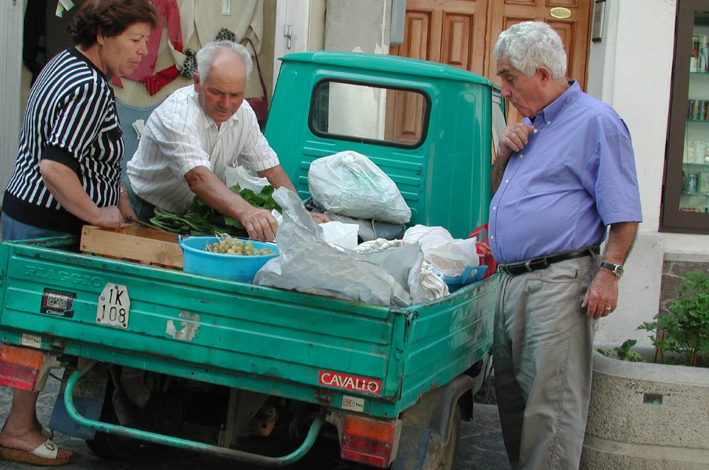
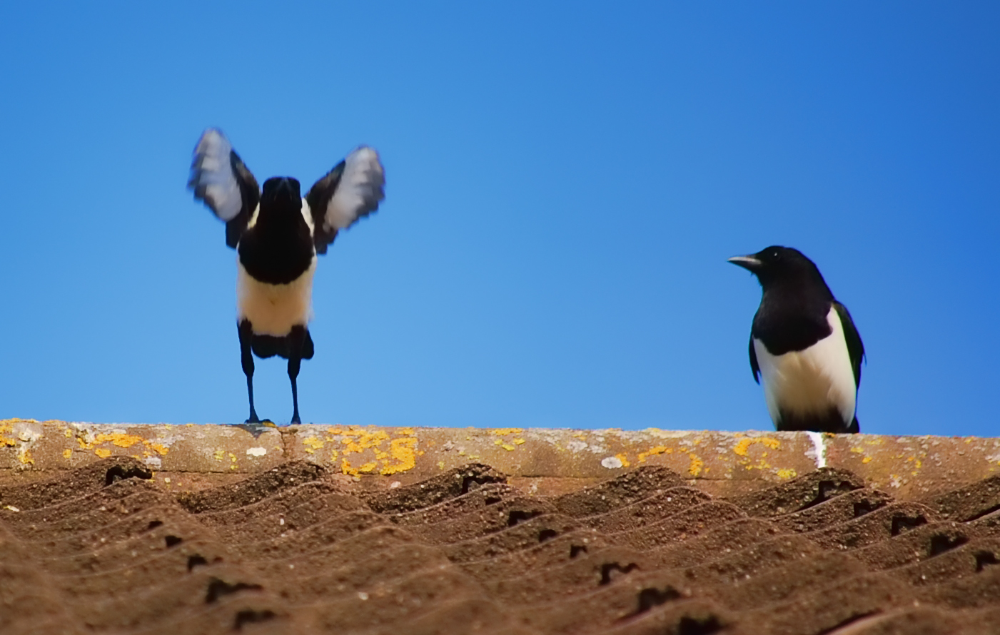

# Agile Developer

### *Joe Wright*
#### __@joe_jag__

---
## What is an agile developer?

## *Let's ask Twitter!*

---
# What is an agile developer?

> Being conscious of value and responsibility. 
> Good communication and being able to adapt and react to change. 
--@mr_urf

---
# What is an agile developer?

> They discuss more with other colleagues about the deliverables, on 2 fronts - Out With their own work but also internal to their own work
--@jennylally

---
# What is an agile developer?

> An agile dev is a dev who can touch their toes
--@PaulBullivant

---
# What is an agile developer?

> An agile developer considers their actions and work against the values and principles of the Agile manifesto.
--@garyfleming

---



----


---
# Practices of an agile developer

----
# The Practice Areas

* Fine Scaled Feedback
* Continuous Process over Batch
* Shared Understanding

----

# Fine Scaled Feedback

----

# Whole Team


----

# Test Driven Development



----

# Pair Programming


----

# Continuous Process Over Batch

-----


# Continuous Integration



-----


# Refactor Mercilessly



-----


# Small Releases



-----
# Shared Understanding

-----

# Simple Design


-----

# Collective Code Ownership


-----

# Coding Standard


----
# The Practice Areas

* Fine Scaled Feedback
  * Whole Team, TDD, Pair Programming
* Continuous Process over Batch
  * CI, Refactor Mercilessly, Small Releases
* Shared Understanding
 * Simple Design, Shared Code, Coding Standard

-----
# How can I introduce this to my workplace?

-----
# We are still learning



----

# Image Attributions

```
Bart Everson        (why)  flickr.com/photos/editor/6698208975
Simon Cunningham    (econmics)  flickr.com/photos/lendingmemo/11942712503
TheMooseFigs        (whole team) flickr.com/photos/99717434@N04/15430427691/
John Ragai          (TDD)  flickr.com/photos/johnragai/9977004814
Taz                 (Pairing) flickr.com/photos/sporkist/157543688
Gonzales            (CI) flickr.com/photos/trypode/2417235560
Keith Peters        (Refactoring) flickr.com/photos/ginyu/12525828084
Peter Rohleder      (Small Releases) flickr.com/photos/homo_sapiens/106450581
Pete Rowbottom      (Simple Design) flickr.com/photos/pete37038/8077854812 
Carlos Maya         (Share) flickr.com/photos/carlos_maya/5165377895
Michael Himbeault   (Coding Standard) flickr.com/photos/riebart/4466482623
Psycho Delia        (Learning) flickr.com/photos/24557420@N05
```

-----
# What are your questions?

### *Joe Wright* 
### joe@joejag.com
### *@joe_jag*


